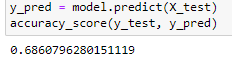
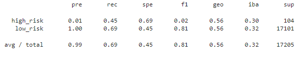
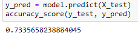
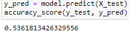

# Credit RiskAnalysis

## Purpose
Various machine learning models/algorithms were used to predict credit risk in potential candidates applying for loans The purpose was to identify which type of machine learning model would provide the most accurate prediction. 

## Results

### Naive Random Oversampling

### SMOTE Oversampling

### Undersampling

### Combination Sampling

## Summary
