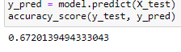

# Credit RiskAnalysis

## Purpose
Various machine learning models/algorithms were used to predict credit risk in potential candidates applying for loans The purpose was to identify which type of machine learning model would provide the most accurate prediction. 

## Results

### Naive Random Oversampling

### SMOTE Oversampling

### Undersampling

### Combination Sampling

## Summary
Note: There are no results for the BalancedRandomForestClassifier or the EasyEnsembleClassifier. Issues occured during the process of evaluating the models. These models will be revisted and updated at a later date. Summary and results are only for the 4 models above.

Based on the results from the models above, the precision for all of them are averaged out to 0.99, indicating a high accuracy. Which means to compare the models, comparing the accuracy scores would be a better indicator. The balanced accuracy score for undersampling was the lowest while the score for SMOTE oversampling was the highest. This indicates that undersampling provided the least accurate prediction at 0.54 and SMOTE oversampling provided the most accurate prediction as 0.73.

SMOTE oversampling is the recommended model to use for machine learning.
